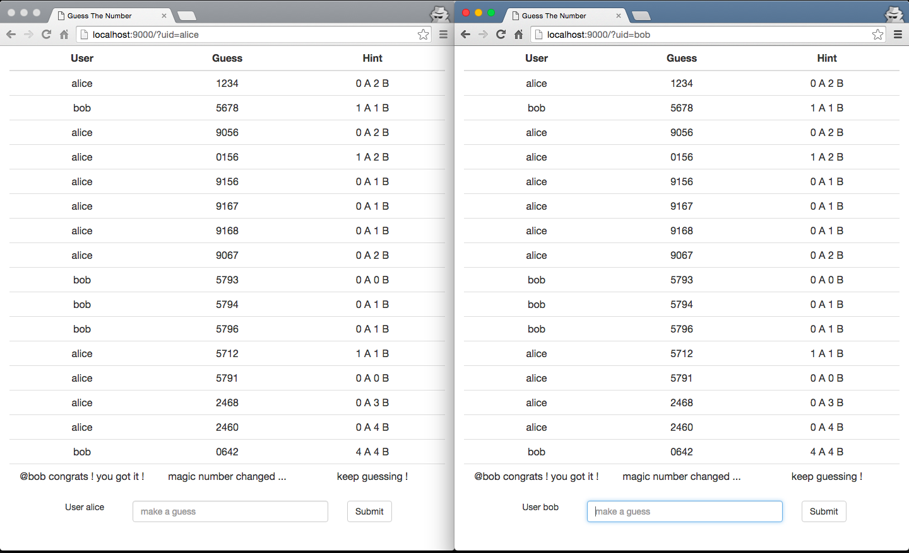

# guess-the-number
Simple multiplayer, chat-based demo game built with typesafe stack (akka, scala, play, websocket).

## Running the game on localhost
```
$ ./activator run
```
navigate to [http://localhost:9000](http://localhost:9000) to start the game.

## Actors
#### [UserActor](app/actors/UserActor.scala)
a UserActor instance will be created for each successful websocket connection. It deals with 2 kinds of messages.

1. on receiving `JsValue` (json string) from websocket, e.g.
   ```json
   {"guess": "1234"}
   ```
   wrapping it into GuessMsg(uid, "1234") and send to GameBoard.
    
2. on receiving `HintMsg(uid, guess, hint)` from GameBoard, convert it to a json string, e.g.
   ```json
   {"uid": "bob", "guess": "1234", "hint": "0 A 3 B"}
   ```
   and send it out to the client through websocket.

#### [GameBoard](app/actors/GameBoard.scala)
a singleton GameBoard instance will be lazily created, it controls the game by  

1. holding the magic number.
2. keep track of connected users.
3. on receiving `GuessMsg` from user, compare it to the magic number to produce hint.
4. send `HintMsg` to all connected users.
4. pick a new magic number when it's been guessed by any user.
